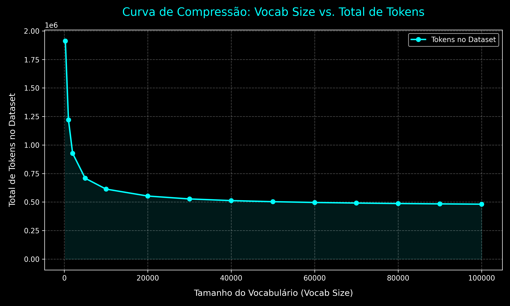

# 03_bpe_tokenizer

## 📝 Sobre este projeto
Neste projeto implementamos um **Tokenizador BPE do ZERO** utilizando apenas linguagem python.

**Tópicos abordados:**
- Lógica e loop principal do tokenizador [BPE.ipynb](./BPE.ipynb)
- Obeto BPETokenizer básico [tokenizer.py](./tokenizer.py)
- Obeto BPETokenizer melhorado [tokenizer_v2.py](./tokenizer_v2.py)
    - Remoção de duplicidade no treinamento.
    - Redução de chunks desnecessário durante o treinamento.
- Obeto BPETokenizer otimizado [tokenizer_v3.py](./tokenizer_v3.py)
    - Treinamento multi-merge
    - Batch-encode (codificação em paralelo)
- Teste em base real (wikipedia) e taxas de compressão [TESTE_BPE.ipynb](./TESTE_BPE.ipynb)

**Datasets que eu utilizei**:
- [Base do wikipedia (202512) tratada](https://drive.google.com/file/d/1JGthoy7aWbU9xz1rGoRxD_epaRZGAsSI/view?usp=sharing)