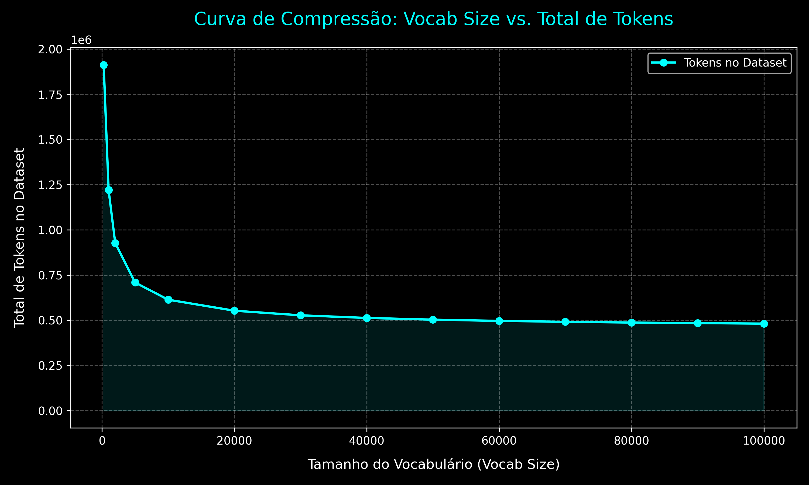

# 03_bpe_tokenizer

<a href="https://www.youtube.com/playlist?list=PLxn5KTcVccYH9APRgvvaeN-JtwkCYLLNc" target="_blank">
  
</a>

## 📝 Sobre este projeto

Neste projeto implementamos um **Tokenizador BPE (Byte Pair Encoding) do ZERO**, utilizando apenas Python puro. O BPE é o algoritmo de tokenização usado em modelos como GPT e LLaMA — entendê-lo "por dentro" é fundamental para compreender como LLMs processam texto.



**Tópicos abordados:**
- Lógica e loop principal do tokenizador - [BPE.ipynb](./BPE.ipynb)
- Objeto `BPETokenizer` básico - [tokenizer.py](./tokenizer.py)
- Objeto `BPETokenizer` melhorado - [tokenizer_v2.py](./tokenizer_v2.py)
    - Remoção de duplicidade no treinamento
    - Redução de chunks desnecessários durante o treinamento
- Objeto `BPETokenizer` otimizado - [tokenizer_v3.py](./tokenizer_v3.py)
    - Treinamento multi-merge
    - Batch-encode (codificação em paralelo)
- Teste em base real (Wikipedia) e taxas de compressão - [TESTE_BPE.ipynb](./TESTE_BPE.ipynb)

---

## 📁 Estrutura do projeto

```
03_bpe_tokenizer/
├── BPE.ipynb               # Exploração passo a passo do algoritmo BPE
├── TESTE_BPE.ipynb         # Avaliação em corpus real (Wikipedia PT)
├── tokenizer.py            # Implementação v1 — versão básica
├── tokenizer_v2.py         # Implementação v2 — mais eficiente
└── tokenizer_v3.py         # Implementação v3 — multi-merge e batch-encode
```

---

## 🚀 Como rodar

### 1. Instale as dependências

```bash
pip install -r requirements.txt
```

> O projeto utiliza apenas Python puro + pandas. Não é necessário PyTorch.

### 2. Explore os notebooks em ordem

1. **[BPE.ipynb](./BPE.ipynb)** — entenda o algoritmo do zero
2. **[TESTE_BPE.ipynb](./TESTE_BPE.ipynb)** — veja o tokenizador em ação num corpus real

### 3. Use o tokenizador no seu código

```python
from tokenizer_v3 import BPETokenizer

tokenizer = BPETokenizer()
tokenizer.train(textos, vocab_size=1000)
ids = tokenizer.encode("Olá, mundo!")
texto = tokenizer.decode(ids)
```

---

## 🛠️ Pré-requisitos

- Python 3.12+
- pandas (ver `requirements.txt`)

---

## 📦 Datasets utilizados

- [Base do Wikipedia PT (202512) tratada](https://drive.google.com/file/d/1JGthoy7aWbU9xz1rGoRxD_epaRZGAsSI/view?usp=sharing)