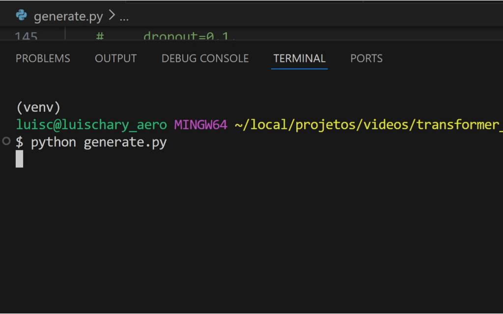

# 07_GPT

<a href="https://youtu.be/-vi44MPkrkI" target="_blank">
  
</a>

## 📝 Sobre este projeto

Neste projeto implementamos um **GPT do zero** — um modelo de linguagem baseado em Transformer *decoder-only* (arquitetura causal), treinado sobre artigos da Wikipedia e avaliações de filmes e e-comerce em português. Construímos cada peça do pipeline: do pré-processamento dos dados até a geração de texto com diferentes estratégias de amostragem.



**Tópicos abordados:**
- Montagem da base de dados (Wikipedia PT) — [monta_base_wiki_review.ipynb](./monta_base_wiki_review.ipynb)
- Pré-tokenização do dataset com BPE — [tokenize_dataset.py](./tokenize_dataset.py)
- Criação dos componentes (tokenizador, dataset, modelo, scheduler) — [src](./src/)
- Loop de treinamento com gradient accumulation e early stopping — [train_decoder_wiki.py](./train_decoder_wiki.py)
- Geração de texto com **Greedy**, **Temperature Sampling** e **Nucleus Sampling (Top-p)** — [generate.py](./generate.py)

---

## 📁 Estrutura do projeto

```
07_GPT/
├── src/
│   ├── model.py        # DecoderLM: Transformer decoder-only (GPT)
│   ├── transformer.py  # Blocos reutilizáveis: FeedForward, Positional Encoding
│   ├── attention.py    # Multi-Head Attention com máscara causal
│   ├── dataset.py      # Dataset para geração de linguagem
│   ├── scheduler.py    # Linear warmup scheduler
│   └── tokenizer.py    # BPETokenizer e tokens especiais
├── artifacts/
│   └── bpe_tokenizer_100k.json   # Merges do tokenizador BPE (100k merges)
├── data/
│   └── links.txt                 # Links dos artigos baixados da Wikipedia
├── media/
│   └── geracao.gif               # Demo da geração de texto
├── monta_base_wiki_review.ipynb  # Coleta e preparação dos dados da Wikipedia
├── tokenize_dataset.py           # Pré-tokeniza o dataset para acelerar o treinamento
├── train_decoder_wiki.py         # Script de treinamento
├── generate.py                   # Geração de texto com diferentes estratégias
└── requirements.txt
```

---

## 🚀 Como rodar

### 1. Instale as dependências

```bash
pip install -r requirements.txt
```

> Para usar GPU (recomendado), o `requirements.txt` já aponta para os binários CUDA do PyTorch.

### 2. Prepare os dados

Execute o notebook para baixar e processar os artigos da Wikipedia em português:

```
monta_base_wiki_review.ipynb
```

### 3. Pré-tokenize o dataset

Tokeniza o dataset com o BPE e salva em disco em partições `.npy` para acelerar o carregamento durante o treinamento:

```bash
python tokenize_dataset.py
```

### 4. Treine o modelo

```bash
python train_decoder_wiki.py
```

O treinamento usa **gradient accumulation**, **LR warmup** e **early stopping**. Os checkpoints são salvos em `modelos_treinados/` e métricas são registradas no TensorBoard.

```bash
# Acompanhe o treinamento em tempo real
tensorboard --logdir modelos_treinados/
```

### 5. Gere texto

```bash
python generate.py
```

Três estratégias de geração disponíveis:

| Estratégia | Função | Descrição |
| :--- | :--- | :--- |
| **Greedy** | `generate` | Sempre escolhe o token mais provável |
| **Temperature** | `generate_by_sample` | Amostra com temperatura para controlar aleatoriedade |
| **Nucleus (Top-p)** | `generate_by_nucleus` | Amostra do menor conjunto de tokens com probabilidade acumulada ≥ `top_p` |

---

## 🏗️ Arquitetura do modelo

O `DecoderLM` é um Transformer *decoder-only* inspirado no GPT:

- **Embedding** de tokens aprendível + **Positional Encoding** senoidal
- Pilha de `TransformerBlock` com:
  - **Masked Multi-Head Self-Attention** (máscara causal para autoregresso)
  - **Feed-Forward** com ativação + dropout
  - **Layer Normalization** (pré-norm)
- Cabeça linear de projeção para o vocabulário BPE

---

## 🛠️ Pré-requisitos

- Python 3.12+
- PyTorch 2.x (CUDA recomendado para treinamento)
- GPU com ≥ 8GB VRAM para experimentos confortáveis

---

## 📦 Dataset utilizado

* [Wikipedia PT — Wikimedia Dumps](https://dumps.wikimedia.org/ptwiki/)

* [Concatenado de avaliações PT-BR](https://www.kaggle.com/datasets/fredericods/ptbr-sentiment-analysis-datasets?select=concatenated.csv)