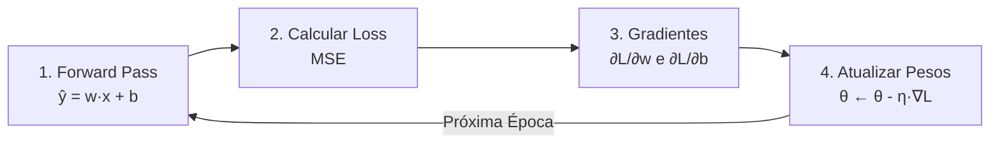

# 14 - Neurônio do Zero: Treinamento Completo sem Frameworks

> **Construindo a mecânica fundamental do Deep Learning usando apenas NumPy e Matplotlib: forward pass, MSE loss, derivadas analíticas e gradiente descendente.**

[](https://youtu.be/F4l2zfs7NYU)

---

## 🎯 O Problema

Imagine olhar para uma reta inicial com peso $w = -1.0$ e viés $b = 0.0$. Ela tem a inclinação totalmente invertida, passa pela região errada do gráfico e produz um erro quadrático médio (MSE) próximo de 20 em relação aos pontos que queremos modelar.

Em bibliotecas modernas como PyTorch ou TensorFlow, resolver isso costuma parecer quase mágico:
```python
loss = criterion(pred, y)
loss.backward()
optimizer.step()
```

Mas o que acontece de verdade "debaixo do capô"? Como dois números simples — um peso $w$ (que controla a inclinação da reta) e um bias $b$ (que controla o deslocamento vertical) — aprendem a se ajustar aos dados sem nenhuma função mágica escondendo o cálculo?

Neste projeto, abrimos a caixa-preta e construímos o **pipeline completo de treinamento do zero absoluto**, usando apenas **NumPy** para as operações matemáticas e **Matplotlib** para visualizar cada transformação.

---

## 💡 O Ciclo Fundamental do Deep Learning

Não importa se o modelo é um neurônio simples de regressão linear ou um Large Language Model (LLM) com centenas de bilhões de parâmetros: o ciclo de treinamento iterativo é rigorosamente o mesmo.

A cada época (*epoch*), executamos quatro etapas essenciais:



### 1. Forward Pass (Inferência)
Produz a previsão da reta para as entradas $x$:
$$\hat{y} = w \cdot x + b$$

### 2. Função de Perda (Loss - Mean Squared Error)
Mede o quão distantes as previsões estão dos valores reais $y$:
$$\mathcal{L} = \frac{1}{N} \sum_{i=1}^N (\hat{y}_i - y_i)^2$$

### 3. Backpropagation Analítico (Cálculo dos Gradientes)
Aplicando a regra da cadeia para encontrar a derivada da loss em relação a cada parâmetro:

Definindo o erro de cada amostra como $e_i = \hat{y}_i - y_i$:

$$\frac{\partial \mathcal{L}}{\partial w} = \frac{2}{N} \sum_{i=1}^N (\hat{y}_i - y_i) \cdot x_i = 2 \cdot \overline{e \cdot x}$$

$$\frac{\partial \mathcal{L}}{\partial b} = \frac{2}{N} \sum_{i=1}^N (\hat{y}_i - y_i) = 2 \cdot \overline{e}$$

### 4. Atualização dos Parâmetros (Gradiente Descendente)
Movemos os parâmetros no sentido oposto ao gradiente, escalados pela taxa de aprendizado ($\eta$):
$$w \leftarrow w - \eta \cdot \frac{\partial \mathcal{L}}{\partial w}$$
$$b \leftarrow b - \eta \cdot \frac{\partial \mathcal{L}}{\partial b}$$

---

## 🔬 Experimento e Resultados

O experimento modela um conjunto de 100 pontos sintéticos gerados por $y = 2x + 3 + \epsilon$ (onde $w_{\text{verdadeiro}} = 2.0$, $b_{\text{verdadeiro}} = 3.0$ e ruído gaussiano $\sigma = 0.5$).

### Configurações de Treinamento
- **Pesos Iniciais:** $w_0 = -1.0$, $b_0 = 0.0$
- **Taxa de Aprendizado ($\eta$):** $0.05$
- **Épocas:** $100$

### Evolução Numérica

| Métrica | Inicial (Época 0) | Final (Época 100) | Alvo Real |
| :--- | :---: | :---: | :---: |
| **Peso ($w$)** | $-1.0000$ | $\approx 2.0125$ | $2.0000$ |
| **Viés ($b$)** | $0.0000$ | $\approx 2.9918$ | $3.0000$ |
| **Loss (MSE)** | $19.7891$ | $\approx 0.2372$ | Menor possível (~ruído $\sigma^2 \approx 0.25$) |

### Artefatos Visuais Gerados

O script gera automaticamente gráficos e vídeos para auditar visualmente a convergência:

1. **`reta_inicial_vs_final.png`**: Comparação direta entre a reta antes do treino (totalmente equivocada) e a reta final ajustada sobre a reta geradora original.
2. **`evolucao_parametros.png`**: Trajetórias de $w$ e $b$ época por época convergindo com precisão para os valores teóricos de referência.
3. **`evolucao_loss.png`**: Curva de decaimento do MSE mostrando a rápida estabilização nos valores mínimos.
4. **`evolucao_reta.mp4`**: Animação em vídeo demonstrando a rotação e translação contínua da reta se acomodando aos dados ao longo das 100 épocas.
5. **`dados_treinamento.json`**: Histórico completo com os valores de $w$, $b$, $\mathcal{L}$, $\frac{\partial \mathcal{L}}{\partial w}$ e $\frac{\partial \mathcal{L}}{\partial b}$ em cada época.

---

## 📂 Estrutura do Código

```
14_neuronio_do_zero/
├── dados.ipynb               # Notebook de exploração e visualização dos dados sintéticos
├── main.py                   # Loop de treino do neurônio do zero com NumPy e geração dos artefatos
├── metricas.py               # Utilitários de visualização estática e renderização de vídeo MP4
├── dados_treinamento.json    # Log estruturado contendo a trajetória de todas as épocas
├── reta_inicial_vs_final.png # Visualização comparativa Antes vs Depois
├── evolucao_parametros.png   # Gráfico temporal da convergência de w e b
├── evolucao_loss.png         # Gráfico da curva de decaimento da função de perda
├── evolucao_reta.mp4         # Vídeo da animação da reta se ajustando época a época
└── requirements.txt          # Dependências do projeto (NumPy e Matplotlib)
```

---

## ▶️ Como Executar

**1. Instale as dependências:**
```bash
pip install -r requirements.txt
```

*(Opcional: para gerar o vídeo `evolucao_reta.mp4`, certifique-se de ter o `ffmpeg` instalado no seu sistema).*

**2. Explore os dados:**
Abra o notebook `dados.ipynb` para visualizar a distribuição dos pontos sintéticos gerados.

**3. Execute o treinamento do zero:**
```bash
python main.py
```
O script exibirá o progresso no terminal a cada 10 épocas, salvará o arquivo `dados_treinamento.json` e gerará os gráficos PNG e o vídeo MP4 na pasta.

---

## 🧠 Conceitos Abordados

- **Neurônio Artificial como Regressão Linear:** Formulação matemática e interpretação geométrica de peso (inclinação) e viés (intercepto).
- **Forward Pass:** Propagação de entrada para estimar saídas sem dependência de autograd.
- **Função de Custo (MSE):** Como quantificar o erro médio quadrático das previsões.
- **Backpropagation Analítico:** Aplicação manual da regra da cadeia para deduzir derivadas parciais ($\partial \mathcal{L} / \partial w$ e $\partial \mathcal{L} / \partial b$).
- **Gradiente Descendente:** Atualização iterativa dos parâmetros no sentido do gradiente negativo.
- **Logging e Diagnóstico de Treinamento:** Rastreamento estruturado de pesos, perdas e animação da fronteira de decisão.

---

## 🛠️ Dependências

| Biblioteca | Versão Mínima | Uso |
| :--- | :---: | :--- |
| `numpy` | `>=1.26` | Geração de dados, operações matriciais e cálculo analítico de gradientes |
| `matplotlib` | `>=3.8` | Gráficos comparativos, curvas de aprendizado e animação com `FuncAnimation` |
