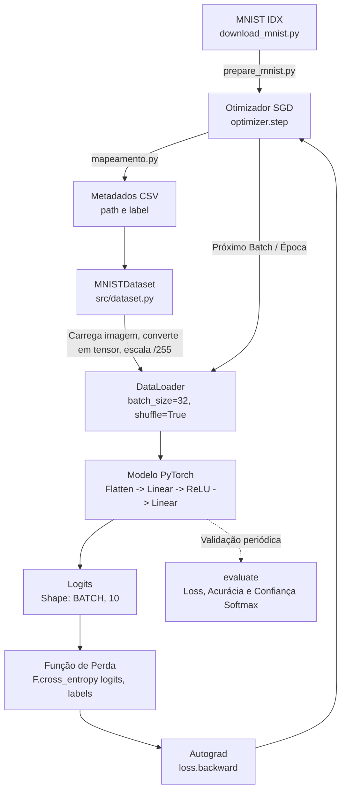

# 15 - Treine sua Primeira Rede Neural com PyTorch: Do Código aos Resultados

> **Construindo o pipeline completo de Deep Learning no PyTorch do zero absoluto: metadados, Dataset, DataLoader, autograd, otimização com SGD, normalização de dados e diagnóstico visual época a época no MNIST.**

[](https://youtu.be/Gs9_rKslisw)

---

## 🎯 Da Teoria Manual ao Framework

Na aula anterior, implementamos um neurônio do zero absoluto usando apenas NumPy e cálculo manual: definimos os dados, calculamos o *forward pass*, avaliamos o erro quadrático (MSE), derivamos as derivadas parciais na mão e atualizamos os parâmetros com a regra do gradiente descendente.

O objetivo daquele exercício foi desmistificar o que acontece "debaixo do capô". Mas quando saímos de uma reta simples com 2 parâmetros ($w$ e $b$) para um problema de visão computacional — como reconhecer dígitos manuscritos no dataset MNIST —, a derivação analítica manual para cada camada se torna inviável.

É aqui que entra o **PyTorch**. O mapa mental e a receita iterativa continuam **rigorosamente os mesmos**, mas o framework assume o trabalho pesado:

| Etapa Conceitual | Implementação Manual (Aula 14) | No PyTorch (Aula 15) |
| :--- | :--- | :--- |
| **Estrutura dos Dados** | Vetores NumPy (`np.array`) | Tensores com suporte a hardware (`torch.Tensor`) |
| **Acesso às Amostras** | Listas e matrizes em memória | Abstração padronizada com `torch.utils.data.Dataset` |
| **Estratégia de Batches** | Fatiamento manual de arrays | Iterador otimizado com `torch.utils.data.DataLoader` (`shuffle`, `batch_size`, `num_workers`) |
| **Arquitetura & Parâmetros** | Variáveis $w$ e $b$ avulsas | Classes herdando de `torch.nn.Module` (`nn.Linear`, `nn.Sequential`) |
| **Cálculo de Gradientes** | Derivadas analíticas deduzidas à mão | Diferenciação automática com Autograd (`loss.backward()`) |
| **Atualização dos Pesos** | Subtração manual $\theta \leftarrow \theta - \eta \cdot \nabla \mathcal{L}$ | Otimizadores nativos (`optimizer.step()`, `optimizer.zero_grad()`) |
| **Avaliação & Métricas** | Cálculo estático pós-treino | Avaliação periódica com `model.eval()` e `torch.no_grad()` |

---

## 💡 O Pipeline de Treinamento no PyTorch

O script de treinamento executa um fluxo modular e bem delimitado:



### 1. Mapeamento e Metadados
Ao invés de varrer pastas repetidamente a cada época, o script `mapeamento.py` varre o diretório de imagens apenas uma vez e gera arquivos CSV estruturados (`metadados_treino.csv` com 60.000 amostras e `metadados_teste.csv` com 10.000 amostras), armazenando o caminho do arquivo e o rótulo do dígito correspondente.

### 2. Dataset Customizado (`MNISTDataset`)
Herda de `torch.utils.data.Dataset` e cumpre o contrato essencial do PyTorch:
- `__len__`: informa a quantidade total de registros.
- `__getitem__`: dado um índice, lê o arquivo PNG com `torchvision.io.read_image`, converte a imagem para tensor float32, aplica a função de transformação de escala e retorna o par `(imagem, label)`.

### 3. DataLoader
Responsável por agrupar os exemplos individuais retornados pelo dataset em tensores de lote (*mini-batches*), embaralhar os dados de treino a cada época (`shuffle=True`) e paralelizar a leitura em segundo plano com múltiplos processos (`num_workers=4`, `persistent_workers=True`).

### 4. A Anatomia do Treinamento
Dentro do loop, cada iteração sobre um batch de dados executa os passos fundamentais:
```python
optimizer.zero_grad()           # 1. Zera gradientes acumulados da iteração anterior
logits = model(batch_imagens)   # 2. Forward pass (produz logits não normalizados)
loss = F.cross_entropy(logits, batch_labels)  # 3. Calcula a perda (Cross-Entropy com Softmax interno)
loss.backward()                 # 4. Backpropagation (autograd preenche .grad de cada parâmetro)
optimizer.step()                # 5. Atualiza os parâmetros na direção oposta ao gradiente
```

---

## 🔬 A Jornada Experimental: Da Escala à Não-Linearidade

O projeto demonstra como três decisões simples de engenharia impactam drasticamente a estabilidade e a acurácia do modelo no conjunto de teste (10.000 imagens).

### 1. Modelo Linear sem Normalização (`linear`)
- **Arquitetura:** `nn.Flatten()` seguido de `nn.Linear(28 * 28, 10)`.
- **Entrada:** pixels brutos no intervalo $[0, 255]$.
- **Problema:** entradas em escala alta provocam logits desproporcionais, gerando valores de perda gigantescos ($\approx 1584$) e gradientes com magnitudes instáveis.
- **Resultado:** o modelo atinge $\approx 87.29\%$ de acurácia, mas a loss flutua sem suavidade.

### 2. O Impacto da Escala dos Dados (`linear_transform`)
- **Arquitetura:** a mesma camada linear (`784 -> 10`), sem alterar nenhum parâmetro da rede.
- **Entrada:** pixels divididos por $255.0$, limitando a escala ao intervalo $[0.0, 1.0]$.
- **Efeito:** as grandezas numéricas se estabilizam, os logits operam dentro de valores controlados e a loss inicial cai de dezenas para a casa de $2.29$, convergindo suavemente para $0.28$.
- **Resultado:** apenas mudando a escala de entrada, a acurácia salta para **$92.13\%$**.

### 3. Introduzindo Não-Linearidade (`mlp`)
- **Arquitetura:** Multilayer Perceptron com camada oculta e ativação não-linear:
  $$\text{Input } (28 \times 28) \longrightarrow \text{Flatten} \longrightarrow \text{Linear}(784, 64) \longrightarrow \text{ReLU} \longrightarrow \text{Linear}(64, 10)$$
- **Entrada:** pixels normalizados em $[0.0, 1.0]$.
- **Efeito:** a adição da função de ativação ReLU quebra a linearidade do espaço vetorial, permitindo que a rede desenhe fronteiras de decisão complexas e curvas entre os dígitos.
- **Resultado:** a acurácia salta para **$96.51\%$** em apenas 5 épocas.

### Comparativo Consolidado

| Modelo | Normalização | Arquitetura | Loss Val (Época 0) | Loss Val (Época 5) | Acurácia Teste | Diagnóstico |
| :--- | :---: | :--- | :---: | :---: | :---: | :--- |
| **Linear Bruto** | Não ($0 - 255$) | `Linear(784, 10)` | $75.92$ | $1273.07$ | $87.29\%$ | Loss instável, gradientes descalibrados por entradas altas |
| **Linear Normalizado** | Sim ($0.0 - 1.0$) | `Linear(784, 10)` | $2.29$ | $0.28$ | $92.13\%$ | Convergência suave e salto imediato de $+4.8\%$ de acurácia |
| **MLP (Não-Linear)** | Sim ($0.0 - 1.0$) | `Linear(784, 64) + ReLU + Linear(64, 10)` | $2.30$ | **$0.12$** | **$96.51\%$** | Fronteiras expressivas, alta precisão e forte calibração |

---

## 📊 Diagnóstico e Inspeção Visual

Para além dos números agregados, o script `metricas.py` gera artefatos de diagnóstico para auditar o aprendizado do modelo:

1. **Evolução Época a Época:**
   - **Época 0 (Antes do Treino):** acurácia de $\approx 10.8\%$, compatível com o chute puramente aleatório entre 10 classes.
   - **Época 1:** a acurácia salta para $>92\%$, mas a rede ainda comete erros com alta confiança em casos difíceis.
   - **Épocas 2 a 5:** refinamento das probabilidades e aumento da confiança nas previsões corretas.

2. **Grades Visuais de Previsões (`grade_previsoes_epoca_X.png`):**
   - Amostras de teste inspecionadas individualmente.
   - Indicação em **verde** para predições corretas e **vermelho** para erros.
   - Exibição da probabilidade estimada via Softmax ($\sigma(z)_i = \frac{e^{z_i}}{\sum_j e^{z_j}}$) para auditar o nível de certeza do modelo.

3. **Curvas de Loss e Acurácia (`evolucao_metricas.png` e `zoom_test.png`):**
   - Comparação da curva de perda de treinamento vs validação, permitindo checar se o modelo está convergindo de forma equilibrada sem overfitting precoce.

4. **Relatório de Classificação Detalhado (`classification_reports.txt`):**
   - Métricas de Precision, Recall e F1-Score discriminadas por dígito ($0$ a $9$) em cada época de treinamento.

---

## 📂 Estrutura do Código

Os arquivos IDX, os 70 mil PNGs e os CSVs são **gerados localmente**; não vêm no clone do GitHub. Os resultados versionados em `modelos_treinados/` são exemplos da execução do vídeo, não substituem a preparação dos dados.

```
15_primeira_rede_pytorch/
├── data/
│   ├── download_mnist.py         # Baixa/extrai os quatro arquivos IDX via torchvision
│   ├── original_loader.py        # Leitor do formato IDX usado na exportação
│   ├── prepare_mnist.py          # Converte os IDX em PNGs por split/classe
│   ├── MNIST/raw/                # Gerado: quatro arquivos IDX (não versionados)
│   ├── MNIST/images/             # Gerado: train/0..9 e test/0..9 em PNG
│   ├── metadados_treino.csv      # Gerado: 60.000 caminhos e labels
│   └── metadados_teste.csv       # Gerado: 10.000 caminhos e labels
├── modelos_treinados/            # Históricos, métricas e grades das execuções
├── src/dataset.py                # Dataset customizado com read_image
├── mapeamento.py                 # Gera ambos os CSVs de metadados
├── train.py                      # Modelo, DataLoaders, loop e evaluate
├── test.py                       # Inspeção opcional de shapes e dados
├── metricas.py                   # Gráficos, relatórios e grades de dígitos
├── pyproject.toml                # Dependências do projeto (Python 3.13)
└── uv.lock                       # Versões resolvidas pelo uv
```

---

## 🚀 Reproduzir a partir de um clone limpo

Execute **todos os comandos a partir da pasta `15_primeira_rede_pytorch/`**, não da raiz do repositório nem de `data/`. É preciso Python 3.13, [`uv`](https://docs.astral.sh/uv/getting-started/installation/) e conexão para o download inicial. Os scripts e o treinamento funcionam em CPU; não é necessário ter GPU. O `train.py` deste vídeo está configurado para CPU.

### 1. Criar o ambiente

```bash
uv sync --frozen
```

As bibliotecas usadas na preparação, treinamento e métricas estão no `pyproject.toml` e no `uv.lock`. Para instalações de PyTorch específicas de GPU, consulte o [seletor oficial](https://pytorch.org/get-started/locally/); isso não é necessário para reproduzir o fluxo em CPU.

### 2. Baixar os dados originais do MNIST

```bash
uv run python data/download_mnist.py
```

Esse script usa o [`torchvision.datasets.MNIST`](https://docs.pytorch.org/vision/stable/generated/torchvision.datasets.MNIST.html) para baixar e extrair os quatro arquivos IDX em `data/MNIST/raw/`:

```text
train-images-idx3-ubyte   train-labels-idx1-ubyte
t10k-images-idx3-ubyte    t10k-labels-idx1-ubyte
```

Se eles já existem, a rotina de download reaproveita o cache. Os arquivos brutos não são enviados ao GitHub.

### 3. Exportar imagens PNG por classe

```bash
uv run python data/prepare_mnist.py
```

O script lê os IDX e gera 60.000 PNGs em `data/MNIST/images/train/<classe>/` e 10.000 em `data/MNIST/images/test/<classe>/`. A conversão de 70 mil arquivos pode demorar e ocupar espaço em disco. As imagens geradas ficam apenas na máquina local.

### 4. Criar os metadados para os dois splits

```bash
uv run python mapeamento.py
```

Isso gera `data/metadados_treino.csv` (**60.000 linhas de dados**) e `data/metadados_teste.csv` (**10.000 linhas de dados**), com colunas `path` e `label` (mais o cabeçalho em cada arquivo). Os caminhos são relativos à pasta do projeto; por isso, rode os próximos comandos ainda em `15_primeira_rede_pytorch/`.

### 5. Treinar e gerar o diagnóstico

```bash
uv run python train.py
uv run python metricas.py
```

`train.py` parte da MLP configurada em `MODEL_NAME = "mlp"` e salva os históricos em `modelos_treinados/mlp/`. `metricas.py` lê esses históricos e cria curvas, grade de previsões e relatório por classe. Resultados podem variar por hardware/versões; as porcentagens do vídeo são da execução demonstrada, não um benchmark universal.

**Se aparecer `FileNotFoundError`:** confira a ordem `download_mnist.py → prepare_mnist.py → mapeamento.py → train.py` e o diretório de onde o comando foi executado. Não rode `mapeamento.py` antes de existirem `data/MNIST/images/train/` e `test/`.
